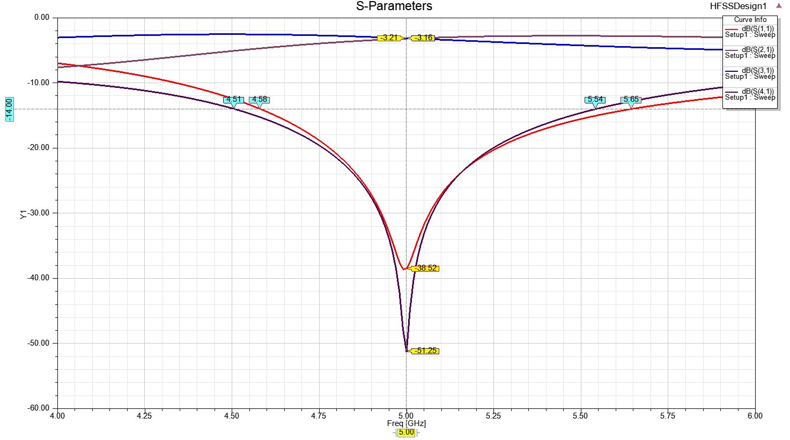

# Hybrid 90° Coupler (Branch-line) Design in HFSS

This project contains the design and simulation of a **Hybrid 90° Coupler** (Branch-line coupler) operating at **5 GHz** using **Ansys HFSS**.

## Project Overview
- **Type:** 3dB Hybrid Coupler (90° Phase Shift)
- **Frequency:** 5 GHz (Resonant Frequency)
- **Simulation Tool:** Ansys HFSS
- **Substrate (if applicable):** [RO4003C]
- **Design Parameters:** [Mention key parameters like line widths, lengths, etc.]

## Features
- Balanced power division (3dB coupling between output ports)
- 90° phase difference between output ports
- Optimized for 5 GHz resonance
- Full-wave EM simulation in HFSS

## Design Specifications
- **Center Frequency:** 5 GHz
- **Bandwidth:** [10%]
- **Insertion Loss:** [-3.16]
- **Return Loss (S11):** [-38]
- **Isolation (S41):** [-51]
- **Phase Difference:** 90° ± [0.6]

## Simulation Results
[Describe key simulation results or include screenshots]
- 
- Phase Difference Verification
- Electric Field Distribution

## Getting Started
### Prerequisites
- Ansys HFSS (Version [XX] or later)
- [Any other dependencies]

### How to Open and Simulate
1. Clone this repository
2. Open `HFSS_Design/Hybrid90_5GHz.aedt` in HFSS
3. Run the simulation

## Optimization
[If applicable, mention any optimization techniques used like parametric sweeps, tuning, etc.]

## References
- [List any papers, books, or resources used in the design]

## License
[Specify your license, e.g., MIT, GNU, or proprietary]

---

**Note:** Replace placeholders (in square brackets) with your actual project details, and add/remove sections as needed.